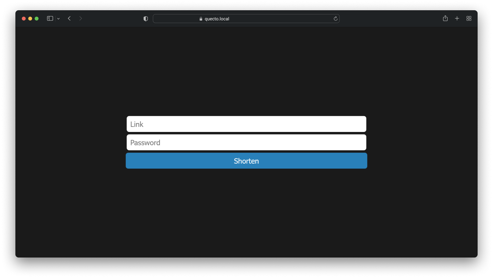
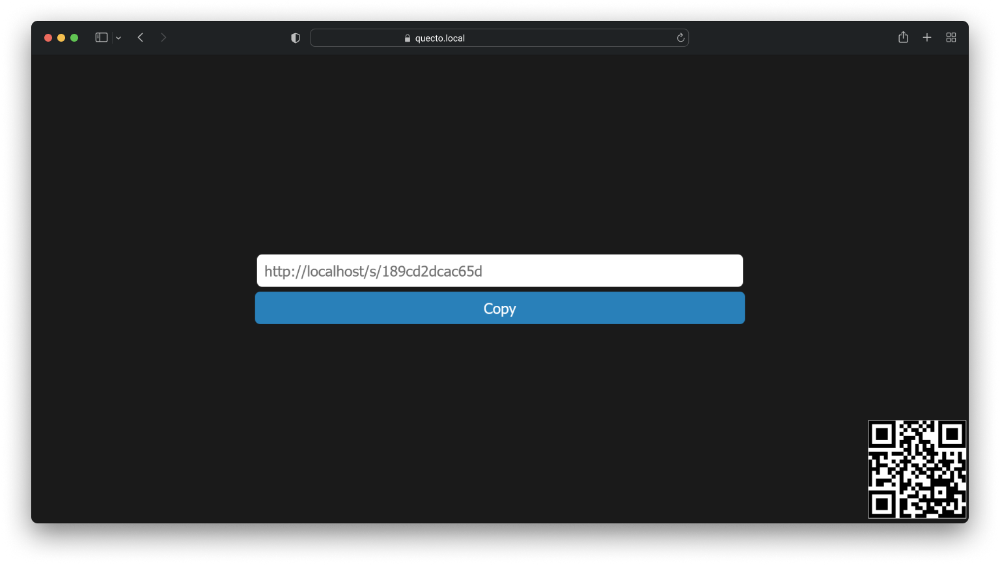

# Quecto
Quecto is a universal, open-source solution that lets you create your own link shortening system.
- An open and self-hostable solution
- Customizable
- Utilisable dès maintenant, hébergé sur [Quecto](https://s.oriondev.fr).




## Installation
### Prerequisites
- Node JS 14.0.0 or higher
- NPM 6.0.0 or higher
- MongoDB 4.0.0 or higher (if you use MongoDB)

### Installation
1. Clone the repository
```bash
git clone https://github.com/oriionn/quecto.git
```
2. Install dependencies
```bash
npm install
```
3. Configure the file `config.js`
```js
module.exports = {
  // The port of the website
  PORT: 80,

  // The domain name of the website
  DOMAIN: "http://localhost",

  // Database type: json, mongodb
  DB_TYPE: "json",

  // mongodb config (if DB_TYPE is mongodb)
  DB_HOST: "127.0.0.1",
  DB_PORT: 27017,
  DB_NAME: "quecto",
  DB_USER: "",
  DB_PASS: "",

  // json config (if DB_TYPE is json)
  DB_JSON_PATH: "./db.json"
}
```

4. Start the server
```bash
npm start
```

## API
### Create a short link
```http
POST /api/shorten
```
#### Parameters
| Name   | Type | Description |
|--------| --- | --- |
| `link` | `string` | **Required**. The URL to shorten. |

#### Response
```json
{
  "status": 200,
  "data": {
    "original": "https://google.com",
    "shorten": "http://quecto.local/abc123"
  }
}
```
(The type of the body is `multipart/form-data`)

(Precise the domain name in the `config.js` file)

### Get a short link
```http
GET /api/s/:code
```

#### Response
```json
{
  "status": 200,
  "data": {
    "original": "https://google.com",
    "shorten": "http://quecto.local/abc123"
  }
}
```

### Know if this instance is a quecto instance
```http
GET /api/quectoCheck
```

#### Response
```json
{
  "status": 200,
  "data": {
    "quecto": true
  }
}
```

## Contributing
Pull requests are welcome. For major changes, please open an issue first to discuss what you would like to change.


## License
[GPL3](https://github.com/oriionn/quecto/blob/main/LICENSE)
